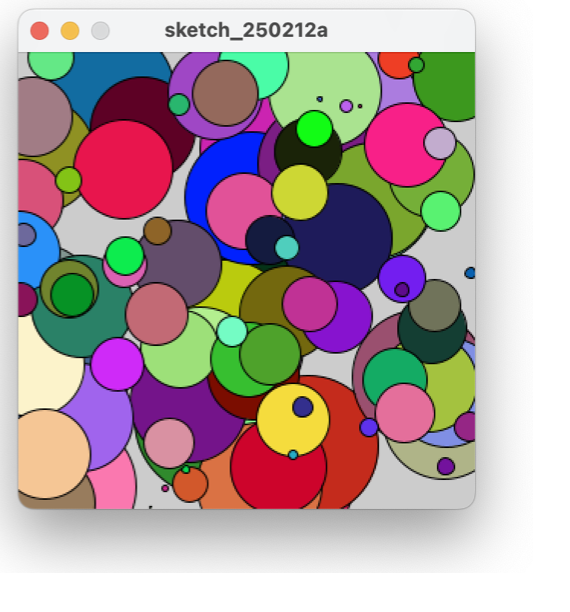

## Task 1: 
I denne opgave skal du lave en switch, som printer antal dage i de forskellige måneder.
- 1.a Lav en variabel `month` af typen String og en anden variabel `days` til at holde antal dage i en måned.
Du kan give `month` en default værdi, f.eks. "Januar".
- 1.b Lav en switch-case konstruktion, der evaluerer på `month` og tildeler `days` en værdi, svarende til antal dage i måneden.
- 1.c Efter switch-case konstruktionen, udskrives en besked til brugeren, f.eks. "Januar har 31 dage"

## Task 2: 
I denne opgave skal du anvende variable i forbindelse med <code>println()</code> kommandoer.
- 2.a gem dit navn i en variable og print det vha. <code>println()</code>.
- 2.b gem din alder i en variable og print den vha. <code>println()</code>.
- 2.c gem hvorvidt du er glad lige nu i en variable af typen boolean (true for glad og false for trist) 
- 2.d ved at bruge de tre ovenstående variable, skal du nu printe følgende besked:
    "Hi, my name is \<name\>" <br />
    "I am \<age\> years old" <br />
    "I (don't) clap my hands" <br />
                                <br />
    hvor \<\> refererer til variable. <br />
    Der skal kun printes "don't" hvis din happy-variable har værdien false. <br />
                                
## Task 3:
I denne opgave skal du bruge relationelle operatorer (fx. <, >, <=) og boolske operatorer(AND, OR, NOT).

- 3.a lav 2 integer variable kaldet `a` og `b`. Print "Success!" hvis en af dem har værdien 10 eller hvis summen af de to variable er 10. Hvis ikke, så print "Failure!".
- 3.b lav 2 integer variable kaldet `min` og `max`. Print "Success!" hvis følgende betingelse er opfyldt: summen af dem skal være højere end 10 og et af tallene skal være mindre end eller lig med 5.
- 3.c lav 3 integer variable kaldet `x`, `y` and `z`. Print "Success!" hvis følgende betingelse er opfyldt: summen af dem er 30, men ingen af dem har værdien 10, 20 eller 30. Ellers print "Failure!".
- Test at din kode virker ved at give variablene forskellige værdier og tjek at det printede output er korrekt. 

 

## Task 4: 
Her skal du øve dig i at skrive for-loops. 
- 4.a print tallene fra 0 til 20 ved hjælp af et for-loop.
- 4.b print alle lige tal fra 0 til 20 ved hjælp af et for-loop. 
<details>
        <summary>
           Hint
        </summary>
        google 'java modulus even number'
    </details>  

- 4.c Lav en variabel kaldet `start` og tildel den en int værdi. Lav et for-loop, som tæller 1 ned fra værdien af variablen `start`. Når dit for-loop når til 0, skal den printe "Take Off!"
- 4.d I det samme for-loop skal du tilføje kode, så tallene 3, 2 og 1 bliver printet som ord ("three", "two", "one").

<details>
        <summary>
           Hint
        </summary>
<code>
String counterAsString=""; <br>
switch(i){ <br>
   case 3: counterAsString = "three" <br>
   ...
}    
</code>code>
</details> 


## Task 5: 
Nu skal du rette noget kode som har fejl og i øvrigt ikke er skrevet færdig.

- Kig på filen i mappen "TaskFive". 
- 5.a løs problemet i <code>methodOne()</code>.
- 5.b løs problemet i <code>methodTwo()</code>.

## Task 6: 
Denne opgave er lidt kringlet. Det er OK at springe den over.

Du skal tegne et trafiklys der skifter på samme måde som et rigtigt trafiklys.
Du kan gøre det på mange måder, men her kommer en opskrift hvor du skal erklære et sæt variable til at holde farverne i et trafiklys og et andet sæt variable, der repræsenterer de tre lys, som enten kan være tændte(hhv. rød, gul eller grøn) eller slukkede(grå). 
På den måde kan du lade selve fill kommandoen være uændret selvom du ændrer farven. 

- 6.a Erklær og initialiser variable til at gemme farverne i et trafiklys. Glem ikke at lave en variabel til farven når lyset er slukket.

**eksempel:** `int red = color(255,0.0);`

- 6.b Erklær og initialiser en variabel for hver af de tre lys/lamper i en lyskurv: `light1`, `light2` og `light3`. De skal hver især pege på den farve som lampen har på et givet tidspunkt. 

**eksempel:** `int light1 = red;`

- 6.c I setup-metoden skal du nu tegne en boks, som vi senere vil tegne lys på.
- 6.d I draw-metoden skal du skrive kode der ændrer værdien af `light1`, `light2` og `light3`. 
Du kan tænke på koden som et skift mellem 4 konstellationer: 
  - En hvor der er rødt lys. 
  ```
  light1 = red;
  light2 = grey
  light3 = grey
  ```
  - En hvor lyset er ved at skifte til grønt. (rød og gul)
  - En hvor der er grønt.
  - En hvor der er gult.

 Du skal skrive de 4 konstellationer i en struktur der sikrer at én af konstellationerne bliver aktiveret med bestemt interval, som minder om et rigtigt trafiklys.
 Intervaller kan opnås med en kombination af modulus og `frameCount`.
<details>
        <summary>
           Hint
        </summary>
<i>pseudokode:</i>
       <code>

     switch(frameCount%400)
        case 0 
        case 100
        case 200
        case 300
       
</code>
    </details> 
- 6.e Til sidst i draw-metoden, tegnes de tre cirkler med hver sin farve.

<details>
        <summary>
           Hint
        </summary>
       <code>

    fill(light1);
    ellipse(width/2, height/2-50, 40, 40);

    // etc...

</code>
    </details> 
    
  
## Task 7: 
- 7.a erklær en integer-variabel kaldet `input` og tildel den værdien 20. Brug et loop til at printe alle tal mellem 'input' og 0 med følgende undtagelser: 
    - hvis tallet er 6, skal der printes strengen "six".
    - når tallet, der skal printe, er det halve af værdien af 'input', skal der printes "HALF!"
- 7.b. Kør din kode fra 7.a igen med en anden værdi for 'input' og se om koden stadig virker. Du kan også overveje hvad du vil gøre ved negative værdier for `input` som fx -20.
    

## Task 8:
100 tilfældigt farvede og tilfældigt placerede cirkler. Skab et lignende billede med et `while`-loop. Koden skal hverken indeholde `setup()` eller `draw()` funktion.



# Husk at push'e ændringerne til jeres Github Repository og linke til det under afleveringen på moodle. 

